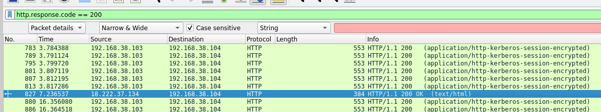
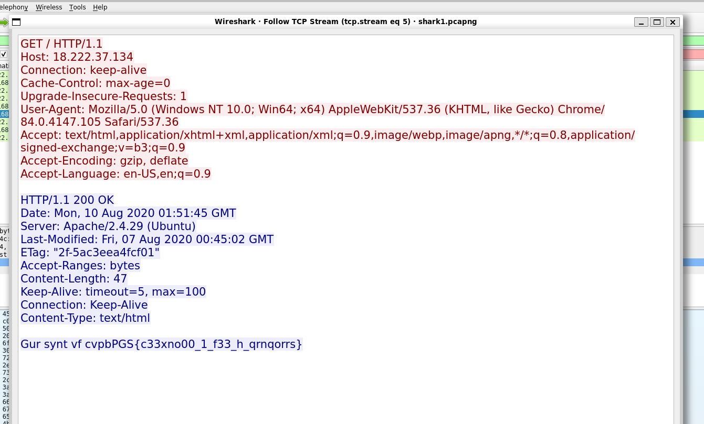

# Wireshark doo dooo do doo...

## Description
Can you find the flag? shark1.pcapng (in same direcotory).

Using Wireshark we could look for the flag on the pcapng capture file provided by the challenge. 

If we search for packets in the file applying a filter for https response 200:



We can then scroll down to one of the few text packages, the hexadecimal view shows us the flag in ROT13 encodig.

Right click and using the follow / TCP stream option from the contextual menu, we can now have a much clear view of the flag.



ROT13 encoded flag: Gur synt vf cvpbPGS{c33xno00_1_f33_h_qrnqorrs}

To decode it I used "tr"

````
echo "Gur synt vf cvpbPGS{c33xno00_1_f33_h_qrnqorrs}" | tr '[G-ZA-Fg-za-f]' '[T-ZA-St-za-s]'
````
the output is a text with our flag: 

```
The flag is picoCTF{p33kab00_1_s33_u_deadbeef}
```

Flag: picoCTF{p33kab00_1_s33_u_deadbeef}